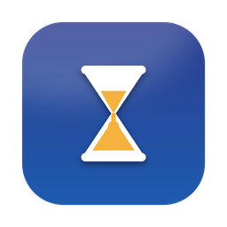

<div align="center">



# PaperRush Bar

**AI 학회 마감을 맥 메뉴바에서 바로.**

`⏳ ICLR D-5` — 브라우저를 열지 않아도 항상 최신 상태로 보입니다.

[English](README.md) · 한국어 · [中文](README.zh.md)


</div>

---

## 무엇을 하나요

Electron도 Python도 없는 약 1MB짜리 네이티브 메뉴바 앱입니다. 가장 가까운 AI/ML 학회 제출 마감까지
남은 날짜를 상단 바에 상시 표시하고, 백그라운드에서 스스로 최신 데이터를 받아옵니다.

마감 데이터는 [**awsaf49/paperrush**](https://github.com/awsaf49/paperrush)에서 가져옵니다.
그 레포가 GitHub Actions로 데이터셋을 갱신하므로, 이 앱은 별도 관리 없이 자동으로 따라갑니다.

| | |
|---|---|
| **메뉴바 D-day** | 별표한 학회 중 가장 가까운 제출 마감을 `ICLR D-5` 형태로 번갈아 표시하고, D-3 안으로 들어오면 그 학회에 고정. 모래시계의 모래 양이 남은 시간(30일 기준)을 보여주고 D-7부터 황색 → 주황 → 빨강으로 물들며, 자정에 모래 한 알이 떨어지고, D-3 안으로 들어오면 가까워질수록 빠르게 모래가 흐르고, D-1부터는 이따금 불안하게 동동거립니다 (동작 줄이기 설정 존중) |
| **매일 자동 업데이트** | 30분마다 확인해 데이터가 6시간 지났으면 재다운로드, 절전에서 깨어날 때도 갱신 |
| **오프라인 대응** | 마지막 데이터는 Application Support에 캐시, 첫 실행용 스냅샷을 앱에 내장 |
| **D-7 / D-3 / D-1 알림** | 해당 날짜 오전 9시 네이티브 알림 — 끄기 / 즐겨찾기만 / 전체 |
| **즐겨찾기** | 실제로 노리는 학회에 ★ 를 찍으면 메뉴바가 그 학회들만 따릅니다. 알림도 같게 맞출 수 있습니다 |
| **클릭 = 사이트 열기** | 행을 누르면 학회 공식 사이트가 열립니다 |
| **학회 추가** | 원본에 없는 18개 + 일부만 있는 7개를 매주 CFP에서 다시 읽어 갱신, 직접 편집하는 파일로 본인 학회도 추가 가능 |
| **직접 검증** | 본인 Gemini API 키를 톱니바퀴 메뉴에 넣으면 각 학회 사이트를 직접 읽어, 인용한 페이지에 실제로 적힌 날짜만 제안합니다. 적용하기 전까지는 아무것도 바뀌지 않습니다 |
| **로그인 시 자동 실행** | `SMAppService` 토글 하나 |
| **3개 국어** | English · 한국어 · 中文, 톱니바퀴 메뉴에서 즉시 전환 (기본값은 시스템 언어) |
| **새 버전 알림** | 새 버전이 나오면 알림 한 번 — 버전당 한 번뿐이고, 별도 토글로 끌 수 있습니다 |

## 설치

```bash
brew tap LucasHyun/tap
brew trust lucashyun/tap
brew install --cask paperrush-bar
```

가운데 줄은 Homebrew 공식 저장소 밖의 tap 을 신뢰한다는 선언입니다. tap 당 한 번만 하면 됩니다.

이후엔 `brew upgrade --cask paperrush-bar` — 새 릴리즈가 나오면 앱이 직접 알려주기도 합니다.
또는 [Releases](https://github.com/LucasHyun/paperrush-bar/releases)에서 `PaperRushBar-vX.zip`을 받아
`/Applications`에 넣으세요 (notarize된 빌드가 아니라 첫 실행은 우클릭 → 열기).

소스에서 빌드하려면 Xcode Command Line Tools(`xcode-select --install`)를 준비하고:

```bash
git clone https://github.com/LucasHyun/paperrush-bar.git
cd paperrush-bar
./build.sh && ./install.sh
```

Xcode 프로젝트도 패키지 매니저도 없습니다 — `build.sh`가 `swiftc`를 한 번 호출해 `.app`을 직접
조립합니다. **macOS 13 (Ventura) 이상** 필요. 제거는 `./uninstall.sh` 또는 `brew uninstall --cask paperrush-bar`.
배포 채널 구성은 [`packaging/`](packaging/README.md)에 있습니다.

> 빌드는 ad-hoc 서명(`codesign --sign -`)을 합니다. 알림과 로그인 항목이 동작하려면 이 서명이 필요합니다.
> Developer ID 서명은 아니므로 첫 실행 시 macOS가 확인을 요구할 수 있습니다.

## 구조

```
Sources/
├─ Models.swift    학회·마감 모델, 날짜 파싱, 카테고리
├─ Store.swift     다운로드·캐시·즐겨찾기·알림 예약·로그인 항목
├─ L10n.swift      앱 내 번역(en/ko/zh) 및 언어별 날짜 형식
├─ MenuView.swift  드롭다운 UI: 검색, 필터, 목록, 설정
├─ HourglassIcon.swift  런타임에 그리는 메뉴바 글리프, 모래 양 = 남은 시간
└─ App.swift       MenuBarExtra 진입점
Resources/conferences.json   최초 실행용 오프라인 스냅샷
Info.plist                   LSUIElement = true (Dock 아이콘 없음)
```

**`js/data.js` 파싱.** 원본은 JSON이 아니라 JS 파일이라 `const CONFERENCES_DATA = {…};` 뒤에
`CATEGORIES`와 `module.exports`가 이어집니다. `Store.extractJSONObject`가 문자열 리터럴과
이스케이프를 건너뛰며 중괄호 깊이를 세어 객체 하나만 잘라냅니다 — 현재 31개 학회 / 225개 마감 전부 파싱됩니다.

**날짜.** 두 형식이 섞여 있습니다. 오프셋이 붙은 ISO(`2026-09-25T23:59:00-12:00`, AoE는 `-12:00`)와
날짜만 있는 값(`2027-04-06`, 로컬 23:59로 취급). D-day는 로컬 시간대 기준 달력 일수 차이라 자정에 정확히 바뀝니다.

**알림 개수.** macOS의 대기 알림 한도 때문에 가장 임박한 제출 마감 20개 × 3회만 예약하고,
데이터가 갱신될 때마다 다시 계산합니다.

## 언어 추가하기

모든 문자열은 `Sources/L10n.swift` 안 표 하나에 있습니다. `AppLanguage`와 `Lang`에 case를 추가하고
로케일 식별자를 지정한 뒤 열을 채우면 끝입니다. 다른 코드는 손댈 필요가 없습니다 — PR 환영합니다.

## 학회 데이터

마감 데이터는 원본에서 오고, 그 위에 오버레이를 덮습니다. 원본에 빠진 학회를 PR이 머지될 때까지
기다리지 않아도 됩니다:

```
내장 extras.json  <  내 extras.json  <  원본 paperrush
```

`id`가 같으면 항상 원본이 이깁니다. 즉 paperrush에 같은 학회가 추가되는 순간 오버레이 항목은 스스로
물러납니다 — 중복이 남거나 따로 정리할 일이 없습니다.

**오버레이** (목록에 `추가` 배지)에는 원본에 없는 18개 학회 — WWW, WSDM, ICDM, CIKM, ECML PKDD,
SIGIR, RecSys, COLM, UAI, ACM MM, AAMAS, ECAI와 NAACL·INTERSPEECH·ICRA·WACV·AAAI·3DV의 다음 회차 —
그리고 원본이 일부만 담고 있는 7개에 대한 패치가 들어 있습니다: KDD 2번째 사이클, ICASSP 2027 전체 일정,
그리고 ACL·EACL·COLING의 ARR commitment 마감(실제로 이 학회들이 기준으로 삼는 날짜입니다).
다음 회차 CFP가 아직 안 나온 학회는 직전 사이클에서 추정한 날짜이며 `예상` 배지가 붙습니다 —
확정된 것처럼 표시하지 않습니다.

이 오버레이는 스스로 최신화됩니다. `scripts/update_extras.py` 가 매주 Actions에서 돌면서
(월요일 06:30 UTC, 원본 작업 직후) 각 마감의 `sourceUrl` 을 다시 읽고 **Gemini 2.5 Flash** 로
일정을 추출한 뒤, 검증된 것만 커밋합니다. CFP가 공개되는 대로 `예상` 이 확정 날짜로 바뀝니다.
앱은 게시된 `Resources/extras.json` 을 네트워크로 읽으므로 **재빌드 없이** 반영되고, 앱에 내장된
사본은 오프라인 폴백 역할만 합니다.

검증 없이는 아무것도 들어가지 않습니다. 모델이 제안한 날짜는 (1) `sourceUrl` 이 실제로 가져온
페이지 중 하나이고 (2) 그 페이지 본문에 그 날짜가 실제로 적혀 있을 때만 채택되며, 검증에 실패하면
기존 값을 그대로 둡니다. 모델이 자기 추정치를 `예상` 에서 확정으로 승격시킬 수도 없습니다.
설정은 시크릿 하나, *Settings → Secrets and variables → Actions* 의 `GEMINI_API_KEY` 뿐입니다.
없으면 그 작업만 실패하고 나머지는 그대로 동작합니다.

```bash
export GEMINI_API_KEY=...
python scripts/update_extras.py --dry-run          # 무엇이 바뀔지만 확인
python scripts/update_extras.py -c www,sigir       # 특정 학회만
```

**패치**: `"mode": "patch"` 와 원본에 있는 `id` 를 가진 항목은 그 학회를 대체하는 대신 **빠진 마감만
덧붙입니다**. KDD는 1년에 두 번 받는데 원본은 Cycle 1만 추적하고 있어서, `kdd-2027` 에 Cycle 2를
패치했습니다. 패치된 마감은 원본이 같은 일정을 게시하면 자동으로 빠집니다(타입 + 날짜로 매칭,
추정치는 45일 이내면 동일한 일정으로 간주).

**내 학회**: 톱니바퀴 메뉴 → *추가된 학회* 를 누르면
`~/Library/Application Support/PaperRushBar/extras.json` 을 만들어 Finder로 열어줍니다.
스키마는 동일하고, 새로고침할 때마다 다시 읽으므로 저장 후 ↻ 한 번이면 끝입니다.

**직접 검증하기**: 톱니바퀴 메뉴 → *Gemini로 마감일 검증…* 을 누르면 본인 Gemini API 키를 입력하는
화면이 열립니다. 키는 macOS 키체인에 저장되고 Google로만 전송되며,
[aistudio.google.com](https://aistudio.google.com/apikey) 의 무료 키로도 한 번의 검사에 충분합니다.
*검사 시작* 을 누르면 각 학회 사이트를 직접 읽어 데이터와 다른 날짜를 모아 보여줍니다. 출처 페이지와
기존 날짜(취소선)가 함께 표시되고, *적용* 을 누르기 전까지는 아무것도 바뀌지 않습니다.

주간 작업과 같은 규칙이 적용됩니다. `sourceUrl` 이 실제로 가져온 페이지이고 그 페이지 본문에 날짜가
적혀 있을 때만 제안합니다. 적용한 날짜에는 `검증` 배지가 붙고 이 Mac에만 저장되며 새로고침할 때마다
다시 덮어씁니다. 다만 각 수정은 자신이 대체한 날짜를 기억했다가 원본이 갱신되면 스스로 물러나므로,
예전에 승인한 날짜가 새로 공개된 날짜를 가리는 일은 없습니다.

마감이 틀렸거나 모두에게 필요한 학회가 빠졌다면 원본인
[awsaf49/paperrush](https://github.com/awsaf49/paperrush)에 고치는 편이 이득입니다.
기여 초안은 [`upstream/`](upstream/)에 준비해 뒀습니다.
본인 포크를 쓰고 싶다면 `Store.sourceURL`만 바꾸세요.

## 라이선스

[MIT](LICENSE). 학회 데이터의 권리는 paperrush 프로젝트와 기여자들에게 있습니다.
